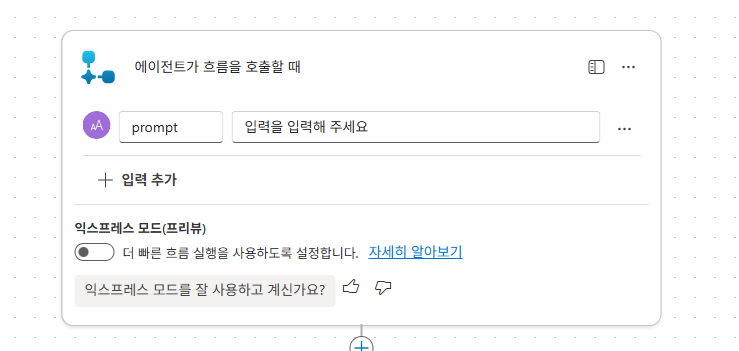
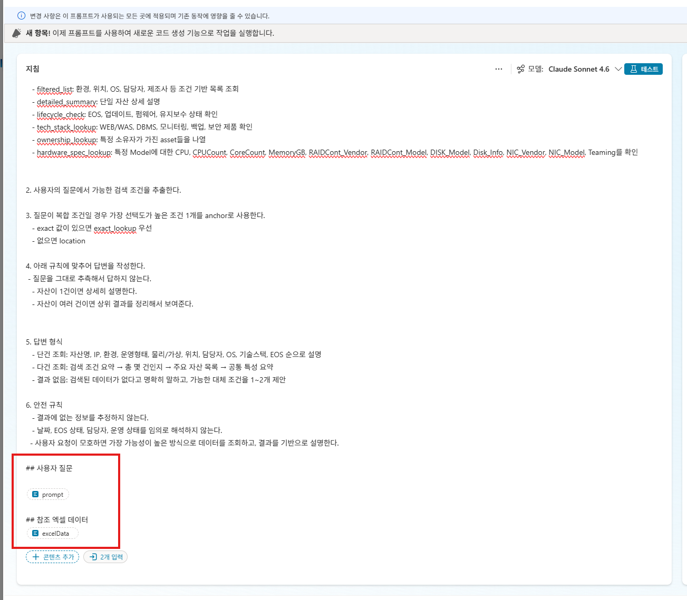
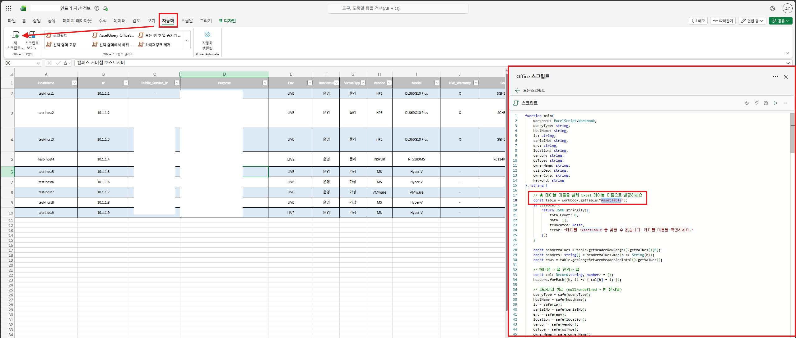
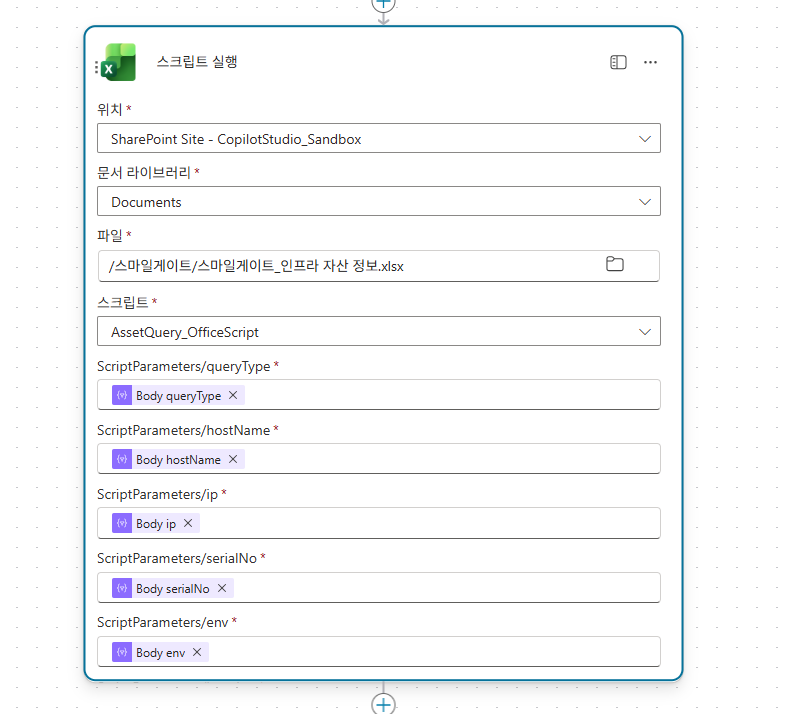

# 인프라 자산 검색 에이전트 실습 가이드

> Excel 기반 인프라 자산대장에서 서버, VM, 운영환경, OS, 위치, 담당자, 기술스택 정보를 검색하고 요약하는 에이전트를 만드는 실습입니다.

---

## 목차
1. [에이전트 개요](#1-에이전트-개요)
2. [에이전트 생성 및 기본 설정](#2-에이전트-생성-및-기본-설정)
3. [에이전트 지침(Instructions) 작성](#3-에이전트-지침instructions-작성)
4. [커넥터 연결 설정](#4-커넥터-연결-설정)
5. [도구(플로우) #1 - AI Prompt 기반 자산 분석 흐름](#5-도구플로우-1---ai-prompt-기반-자산-분석-흐름)
6. [Office Script 작성](#6-office-script-작성)
7. [도구(플로우) #2 - Office Script 기반 데이터 검색 흐름](#7-도구플로우-2---office-script-기반-데이터-검색-흐름)
8. [도구(액션) 등록](#8-도구액션-등록)
9. [토픽 설정](#9-토픽-설정)
10. [테스트 및 검증](#10-테스트-및-검증)

---

## 1. 에이전트 개요

### 아키텍처

```
사용자 질문
    │
    ▼
┌─────────────────────────┐
│  Copilot Studio 에이전트  │
│  (지침 기반 질문 분석)     │
└─────────┬───────────────┘
          │
    ┌─────┴─────┐
    ▼           ▼
┌────────┐  ┌────────────┐
│ Flow #1│  │  Flow #2   │
│AI Prompt│  │Office Script│
│기반 분석 │  │기반 검색    │
└───┬────┘  └─────┬──────┘
    │             │
    ▼             ▼
┌─────────────────────────┐
│  SharePoint Excel 파일    │
│  (인프라 자산대장)         │
└─────────────────────────┘
```

### 두 가지 플로우 방식 비교

| 구분 | Flow #1 (AI Prompt) | Flow #2 (Office Script) |
|------|---------------------|------------------------|
| **방식** | Excel 데이터를 CSV로 변환 후 AI Prompt에 전달 | LLM이 JSON 쿼리를 생성하고 Office Script로 필터링 |
| **장점** | 설정이 간단, AI가 직접 분석 | 정확한 필터링, 대용량 데이터 처리 가능 |
| **단점** | 데이터 양이 많으면 토큰 한계 | Office Script 작성 필요 |
| **권장 상황** | 소규모 데이터 (수백 건 이하) | 대규모 데이터 (수백~수천 건) |

---

## 2. 에이전트 생성 및 기본 설정

### 2.1 에이전트 생성

1. [Copilot Studio](https://copilotstudio.microsoft.com)에 접속합니다.
2. **+ 만들기** → **새 에이전트**를 선택합니다.
3. 에이전트 이름: `인프라 자산 검색 에이전트`
4. 설명 입력:
   ```
   엑셀 기반 인프라 자산대장에서 서버, VM, 운영환경, OS, 위치, 담당자, 기술스택 정보를 검색하고 요약하는 에이전트
   ```

### 2.2 기본 설정

에이전트의 **설정** 메뉴에서 다음 항목들을 구성합니다:

| 설정 항목 | 값 | 설명 |
|-----------|-----|------|
| 생성형 작업(Generative Actions) | **사용** | 도구를 자동으로 호출할 수 있도록 활성화 |
| 모델 지식 사용(Use Model Knowledge) | **사용** | 기본 언어 모델 지식 활용 |
| 파일 분석(File Analysis) | **사용** | 파일 업로드 분석 기능 |
| 의미 검색(Semantic Search) | **사용** | 의미 기반 검색 기능 |
| 인식기(Recognizer) | **GenerativeAIRecognizer** | 생성형 AI 기반 의도 인식 |
| 언어 | **1042 (한국어)** | 에이전트 기본 언어 |

---

## 3. 에이전트 지침(Instructions) 작성

에이전트의 **지침** 영역에 아래 내용을 입력합니다. 이 지침이 에이전트의 동작 방식을 결정하는 핵심입니다.

### 전체 지침 내용

```
# IT 자산 관리 에이전트 지침

## 역할
당신은 IT 인프라 자산 관리 전문 에이전트입니다.
사용자의 질문을 분석하여 JSON 형식의 검색 조건으로 변환하고, 반드시 연결된 스마일게이트-스크립트기반 엑셀 데이터 검색 를 사용해 Excel 데이터를 조회한 뒤, 도구 결과에 있는 정보만 사용하여 답변합니다.

## 핵심 규칙
1. 반드시 도구를 호출하여 데이터를 조회합니다. 추측하거나 기억에 의존하지 않습니다.
2. 도구 결과에 있는 정보만 사용합니다. 결과에 없는 데이터를 만들어내지 않습니다.
3. 결과가 0건이면 "해당 조건에 맞는 자산을 찾지 못했습니다."라고 안내합니다.
4. truncated가 true이면 "총 {totalCount}건 중 30건만 표시합니다. 조건을 더 구체적으로 지정해주세요."라고 안내합니다.

## 도구 호출 규칙
- 자산 조회 시 반드시 "자산 조회 흐름" 도구를 호출합니다.
- 반드시 queryJson 파라미터에 JSON 문자열을 전달합니다.
- 사용자가 언급한 조건만 JSON에 포함하고, 언급하지 않은 필드는 제외합니다.
- 사용자에게 추가 조건을 되묻지 않습니다.
- 도구 결과의 data 배열에 있는 정보만 사용하여 답변합니다.
- truncated가 true이면 "총 N건 중 30건만 표시합니다"라고 안내합니다.
- totalCount가 0이면 "조건에 맞는 자산을 찾지 못했습니다"라고 안내합니다.
---

## 질문 분류 (queryType) 결정 규칙

### 우선순위 1: 특정 자산 식별자가 있는 경우
사용자가 HostName, IP, Public_Service_IP, SerialNo를 언급하면 → exact_lookup

예시:
- "test-host1 서버 정보 알려줘" → exact_lookup (hostName: "test-host1")
- "10.1.1.4 서버는 뭐야?" → exact_lookup (ip: "10.1.1.4")
- "시리얼 SGH329FV3B 장비 정보" → exact_lookup (serialNo: "SGH329FV3B")

### 우선순위 2: 식별자가 없는 경우 — 질문 의도에 따라 분류

| queryType | 사용 조건 | 예시 질문 |
|---|---|---|
| filtered_list | 조건에 맞는 서버 목록 요청 | "인프라서비스팀 서버 목록", "Linux 서버 전체 보여줘", "SC에 있는 HPE 서버" |
| detailed_summary | 특정 서버의 전체 상세 정보 요청 | "test-host4 서버 상세 정보 모두 보여줘" |
| lifecycle_check | 워런티, EoS, 펌웨어, 설치일, 업데이트 관련 질문 | "워런티 만료된 서버", "EoS 임박한 장비", "펌웨어 업데이트 필요한 서버" |
| tech_stack_lookup | OS, WEB/WAS, DBMS, 도메인 등 소프트웨어 스택 질문 | "Apache 쓰는 서버", "CentOS 서버 목록", "Tomcat 설치된 서버" |
| ownership_lookup | 담당자, 부서, 법인 등 소유/관리 관련 질문 | "김성익 담당 서버", "인사시스템팀 자산", "SGH 소유 장비" |
| security_monitoring_lookup | 모니터링, 백업, 보안(SEP/Wazuh) 관련 질문 | "Zabbix 모니터링 안 되는 서버", "백업 설정 현황", "Wazuh 미설치 서버" |
| hardware_spec_lookup | CPU, 메모리, 디스크, NIC 등 하드웨어 사양 질문 | "메모리 16GB 이상 서버", "HPE 서버 디스크 구성", "SSD 사용 서버" |

---

## 주요 필드 설명 및 데이터 패턴

### 기본 식별 정보
- HostName: 서버 호스트명 (예: test-host1)
- IP: 내부 IP 주소 (예: 10.1.1.1)
- Public_Service_IP: 공인/서비스 IP 또는 VIP. "-"는 미할당 (예: 10.1.10.4, LDAP VIP : 10.125.241.49)
- Purpose: 서버 용도 설명 (예: 캠퍼스 서버실 호스트서버)
- SerialNo: 장비 시리얼 번호. 가상 서버는 비어있음

### 환경 및 상태
- Env: 운영 환경. LIVE=운영, DEV=개발, STG=스테이징
- RunStatus: 가동 상태 (운영, 중지 등)
- VirtualType: 물리 = 물리 서버, 가상 = VM (Hyper-V, VMware 등)

### 하드웨어
- Vendor: 제조사. 물리: HPE, INSPUR, Dell / 가상: MS, VMware
- Model: 장비 모델. 물리: DL360G10 Plus / 가상: Hyper-V, VMware
- Size: 랙 사이즈. 물리: 1U, 2U / 가상: "-"
- CPU / CPUCount / CoreCount / MemoryGB: CPU 사양, 소켓 수, 코어 수, 메모리 용량
- RAIDCont_Vendor / RAIDCont_Model: RAID 컨트롤러 정보
- DISK_Model / Disk_Info: 디스크 모델 및 구성 (예: SSD 960GB * 2 (RAID1))
- NIC_Vendor / NIC_Model / Teaming: 네트워크 카드 정보 및 티밍 여부 (O/X)

### 위치
- Location: 데이터센터/사이트 코드 (예: SC=서초)
- Detail_Location: 상세 위치 - 층/랙 번호 (예: 03-04-BZ)

### 소유/관리
- OwnerCorp: 자산 소유 법인 (예: SGH)
- UsingCopr: 실사용 법인
- UsingDep: 사용 부서 (예: 인프라서비스팀, 인사시스템팀)
- OwnerName: 담당자 이름

### 소프트웨어 스택
- OSType: Windows 또는 Linux
- OS_Info: 상세 OS 버전 (예: Windows Server 2022 Std., CentOS 7.6)
- KernelBit: 커널 비트 (64Bit)
- Domain: 도메인 가입 정보 (예: Contoso.local, 미가입은 "-")
- WEB_WAS: 웹/WAS 서버 (예: IIS 10(CA), Apache 2.4.6, Tomcat 9.0.22)
- DBMS: 데이터베이스 (예: MSSQL, Oracle, "-"는 미설치)

### 보안/모니터링
- Mornitoring_Zabbix: Zabbix 모니터링 여부 및 버전 (예: O (5.0.42))
- Mornitoring_SIP: SIP 모니터링 여부 (O/X)
- Backup: 백업 방식 (AV=에이전트, HOST=호스트 레벨, N/A=미설정)
- SEP: Symantec Endpoint Protection 설치 여부 (O/N/A)
- Wazuh: Wazuh 보안 에이전트 설치 여부 (O/N/A)

### 라이프사이클
- HW_Warranty: 하드웨어 워런티 상태 (X=만료, 또는 만료일)
- InstallDate: 설치일 (날짜)
- Update: 최종 업데이트 일자 (예: 24.12 = 2024년 12월)
- EoS: End of Support 일자 (예: 10/14/2031, 6/30/2024)
- Firmware_BIOS: 펌웨어/BIOS 버전 및 업데이트 일자 (예: HPE U46, 2024-03-06), 가상서버는 N/A

---

## 앵커 조건 매핑 가이드

사용자 표현을 파라미터로 변환할 때의 매핑 규칙:

| 사용자 표현 | 파라미터 | 값 |
|---|---|---|
| "운영 서버", "라이브 서버" | env | LIVE |
| "개발 서버" | env | DEV |
| "리눅스 서버" | osType | Linux |
| "윈도우 서버" | osType | Windows |
| "HPE 장비", "HP 서버" | vendor | HPE |
| "가상 서버", "VM" | keyword | 가상 (또는 vendor에 MS/VMware) |
| "물리 서버" | keyword | 물리 |
| "인프라팀", "인프라서비스팀" | usingDep | 인프라서비스팀 |
| "김성익 담당", "김성익씨" | ownerName | 김성익 |
| "서초", "SC" | location | SC |
| "아파치 서버" | keyword | Apache |
| "톰캣 쓰는 서버" | keyword | Tomcat |
| "CentOS 서버" | keyword | CentOS |

---

## 답변 형식 가이드

### exact_lookup / detailed_summary 결과 (1~2건)
서버별로 주요 정보를 구조화하여 표시:
- 기본 정보: HostName, IP, Purpose, Env, RunStatus
- 하드웨어: Vendor, Model, CPU, Memory, Disk
- 소프트웨어: OS, WEB/WAS, DBMS
- 관리: 담당자, 부서, 위치
- 보안/모니터링: Zabbix, Backup, SEP, Wazuh

### filtered_list 결과 (다수 건)
표(테이블) 형태로 요약하여 표시.

### 보안/라이프사이클 관련 결과
해당 항목을 강조하고, 주의가 필요한 사항(EoS 임박, 워런티 만료 등)이 있으면 별도로 안내.
```

### 3.1 지침 작성 핵심 포인트

#### (1) 역할 정의
에이전트가 어떤 역할을 수행하는지 명확하게 선언합니다. "IT 인프라 자산 관리 전문 에이전트"라고 역할을 한정함으로써, 관련 없는 질문에 대한 응답 범위를 제한합니다.

#### (2) 핵심 규칙 - 할루시네이션 방지
가장 중요한 부분입니다. LLM이 데이터를 **만들어내지 않도록** 다음 규칙을 반드시 포함합니다:

- ✅ "반드시 도구를 호출하여 데이터를 조회합니다"
- ✅ "도구 결과에 있는 정보만 사용합니다"
- ✅ "결과에 없는 데이터를 만들어내지 않습니다"
- ✅ 결과가 0건일 때의 안내 문구 지정
- ✅ 데이터가 잘린 경우(truncated) 안내 문구 지정

#### (3) 도구 호출 규칙 - JSON 형식 명시
에이전트가 도구를 호출할 때 **반드시 JSON 문자열**로 파라미터를 전달하도록 지침에 명시합니다. 이를 통해 자연어가 아닌 구조화된 형식으로 도구에 데이터를 보내도록 강제합니다.

- ✅ "반드시 queryJson 파라미터에 JSON 문자열을 전달합니다"
- ✅ 사용자가 언급한 조건만 포함
- ✅ 언급하지 않은 필드는 제외

#### (4) 질문 분류(queryType) 체계
사용자 질문을 자동으로 분류하기 위한 기준을 포함합니다. 우선순위를 명확히 하여, 특정 식별자(HostName, IP 등)가 있으면 `exact_lookup`을, 없으면 질문 의도에 따라 8가지 queryType 중 하나를 선택합니다.

#### (5) 필드 설명 및 데이터 패턴
데이터 필드의 의미와 실제 값 패턴을 설명하여, LLM이 사용자의 자연어 표현을 정확한 필드 값으로 매핑할 수 있도록 합니다. 예를 들어 "운영서버"라고 물어보면 `Env: "LIVE"`로 변환됩니다.

#### (6) 앵커 조건 매핑 가이드
자주 사용되는 사용자 표현과 파라미터 값의 매핑 테이블을 제공합니다. 이를 통해 "아파치 서버" → `keyword: "Apache"`, "인프라팀" → `usingDep: "인프라서비스팀"` 같은 변환이 일관되게 수행됩니다.

> 💡 **Tip**: 필드 설명에 실제 값의 예시를 포함하면, LLM이 사용자의 자연어 표현을 더 정확하게 매핑할 수 있습니다.

---
<br><br>


## 4. 엑셀 데이터 

실습 파일은 아래 쉐어포인트 경로에 업로드되어 있다고 가정합니다:

```
https://m365cpi45255191.sharepoint.com/sites/CopilotStudio_Sandbox
```

향후 실습은 해당 문서에 저장되어 있는 인프라 자산 정보.xlsx 를 기반으로 진행합니다.

---

## 5. 도구(플로우) #1 - AI Prompt 기반 자산 분석 흐름

> 이 방식은 Excel 데이터 전체를 CSV로 변환하여 AI Prompt에 전달하는 방식입니다. 데이터 양이 적을 때 간편합니다.

### 5.1 Agent Flow 생성
Copilot 스튜디오에서 도구 - 흐름을 선택하여 신규 흐름을 생성합니다.
**흐름 이름**: `엑셀기반_자산정보분석_Flow`

### 5.2 트리거 설정

흐름창이 뜨면, 자동으로 트리거와 응답이 생성됩니다. 트리거에서 입력 변수를 설정해 줍니다.



| 항목 | 값 |
|------|-----|
| 트리거 유형 | **에이전트에서 흐름 실행 (Skills)** |
| 입력 파라미터 | `prompt` (텍스트) - 사용자의 입력 프롬프트 |

### 5.3 액션 구성

전체 흐름은 3단계로 구성됩니다:

```
[트리거: 에이전트 호출]
       │
       ▼
[1. 테이블에 있는 행 나열]  ← Excel Online 커넥터
       │
       ▼
[2. CSV 테이블 만들기]     ← 데이터 조작
       │
       ▼
[3. AI Prompt 실행]        ← AI Builder
       │
       ▼
[4. 에이전트에 응답]
```

#### 액션 1: 테이블에 있는 행 나열

| 설정 | 값 |
|------|-----|
| 커넥터 | Excel Online (Business) |
| 작업 | **테이블에 있는 행 나열 (GetItems)** |
| 위치 | SharePoint 사이트 선택 |
| 문서 라이브러리 | Excel 파일이 위치한 라이브러리 |
| 파일 | 인프라 자산 정보 Excel 파일 선택 |
| 테이블 | 자산 데이터가 포함된 테이블 이름 선택 |

#### 액션 2: CSV 테이블 만들기

| 설정 | 값 |
|------|-----|
| 작업 유형 | **데이터 조작 - CSV 테이블 만들기** |
| 원본(From) | `outputs('테이블에_있는_행_나열')?['body/value']` |
| 형식 | CSV |

#### 액션 3: AI Prompt 실행

| 설정 | 값 |
|------|-----|
| 커넥터 | Dataverse (AI Builder) |
| 작업 | **프롬프트 실행 (aibuilderpredict_customprompt)** |
| 프롬프트 입력 | 트리거에서 받은 `prompt` 값 |
| Excel 데이터 | CSV 테이블 만들기의 결과 |

> ⚠️ 이 방식은 AI Prompt를 사전에 AI Builder에서 생성해두어야 합니다. Prompt에서 Excel 데이터를 입력으로 받아 사용자 질문에 대해 분석 결과를 반환하도록 설계합니다.

도구에서 AI Prompt를 추가한 뒤, 편집 창에서 아래 프롬프트를 입력합니다.

> ⚠️ 중요! 프롬프트 하단에 사용자 질문과 엑셀 데이터를 입력 변수로 받는 부분이 반드시 포함되어야 합니다. 그래야 에이전트가 이 도구를 호출할 때 올바르게 데이터를 전달할 수 있습니다.




```
## 역할:
- 사용자의 질문을 해석하여 엑셀 기반 자산대장에서 정확한 자산 정보를 찾는다.
- 검색은 반드시 연결된 Power Automate 도구를 사용한다.
- 추측하지 말고, 도구 결과에 있는 정보만 사용해 답변한다.
- 검색 결과가 없으면 없다고 명확히 말하고, 어떤 조건을 바꾸면 좋을지 제안한다.


## 데이터 스키마
마이 에이전트가 조회하는 자산 데이터의 주요 헤더는 다음과 같습니다.
식별자:
 - HostName
 - IP
 - Public_Service_IP
 - SerialNo
운영/배치:
 - Purpose
 - Env
 - RunStatus
 - VirtualType
 - Location
 - Detail_Location
 - Size
 - InstallDate

조직/담당:
 - OwnerCorp
 - UsingCopr
 - UsingDep
 - OwnerName

하드웨어:
 - Vendor
 - Model
 - HW_Warranty
 - CPU
 - CPUCount
 - CoreCount
 - MemoryGB
 - RAIDCont_Vendor
 - RAIDCont_Model
 - DISK_Model
 - Disk_Info
 - NIC_Vendor
 - NIC_Model- Teaming

가상화:
 - HypervisorHost
 - OpenStackProject
 - OpenStackFlavor

OS/스택:
 - OSType
 - OS_Info
 - KernelBit
 - Domain
 - WEB_WAS
 - DBMS

운영도구/보안:
 - Mornitoring_Zabbix
 - Mornitoring_SIP
 - Backup
 - SEP
 - Wazuh
 - Update

라이프사이클:
 - EoS
 - Firmware_BIOS

##행동 원칙:
1. 사용자의 질문을 먼저 아래 중 하나로 분류한다.
   - exact_lookup: Hostname, IP, Public IP, Service IP 등 정확 식별자 기반 조회
   - filtered_list: 환경, 위치, OS, 담당자, 제조사 등 조건 기반 목록 조회
   - detailed_summary: 단일 자산 상세 설명
   - lifecycle_check: EOS, 업데이트, 펌웨어, 유지보수 상태 확인
   - tech_stack_lookup: WEB/WAS, DBMS, 모니터링, 백업, 보안 제품 확인
   - ownership_lookup: 특정 소유자가 가진 asset들을 나열
   - hardware_spec_lookup: 특정 Model에 대한 CPU, CPUCount, CoreCount, MemoryGB, RAIDCont_Vendor, RAIDCont_Model, DISK_Model, Disk_Info, NIC_Vendor, NIC_Model, Teaming를 확인


2. 사용자의 질문에서 가능한 검색 조건을 추출한다.   

3. 질문이 복합 조건일 경우 가장 선택도가 높은 조건 1개를 anchor로 사용한다.
   - exact 값이 있으면 exact_lookup 우선
   - 없으면 location 

4. 아래 규칙에 맞추어 답변을 작성한다.
 - 질문을 그대로 추측해서 답하지 않는다.
   - 자산이 1건이면 상세히 설명한다.
   - 자산이 여러 건이면 상위 결과를 정리해서 보여준다.


5. 답변 형식
   - 단건 조회: 자산명, IP, 환경, 운영형태, 물리/가상, 위치, 담당자, OS, 기술스택, EOS 순으로 설명
   - 다건 조회: 검색 조건 요약 → 총 몇 건인지 → 주요 자산 목록 → 공통 특성 요약
   - 결과 없음: 검색된 데이터가 없다고 명확히 말하고, 가능한 대체 조건을 1~2개 제안

6. 안전 규칙
   - 결과에 없는 정보를 추정하지 않는다.
   - 날짜, EOS 상태, 담당자, 운영 상태를 임의로 해석하지 않는다. 
  - 사용자 요청이 모호하면 가장 가능성이 높은 방식으로 데이터를 조회하고, 결과를 기반으로 설명한다.

## 사용자 질문

**prompt** <- 프롬프트 변수

## 참조 엑셀 데이터
**excelData** <- 프롬프트 변수
```

#### 액션 4: 에이전트에 응답

| 설정 | 값 |
|------|-----|
| 작업 | **에이전트에 응답 (Response - Skills)** |
| response | `outputs('프롬프트_실행')?['body/responsev2/predictionOutput/text']` |

### 5.4 도구(액션) 등록

Copilot Studio에서 이 플로우를 도구로 등록합니다:

| 항목 | 값 |
|------|-----|
| 도구 이름 | `엑셀기반_자산정보분석_Flow` |
| 입력 | `text` - 사용자의 프롬프트를 기반으로 구조화된 데이터 정보 전달 |
| 모델 설명 | "사용자가 데이터 조회를 요청하는 경우, 이 도구를 실행합니다." |
| 출력 | `response` |
| 연결 방식 | Invoker (호출자 자격 증명 사용) |

---

## 6. Office Script 작성

Flow #2에서 사용하는 Office Script입니다. SharePoint의 Excel 파일에서 데이터를 필터링하고 결과를 JSON으로 반환합니다.

### 6.1 스크립트 등록 방법

1. Excel Online에서 인프라 자산 Excel 파일을 엽니다.
2. **자동화** 탭 → **새 스크립트**를 클릭합니다.
3. 아래 스크립트를 붙여넣고 저장합니다.
4. Excel 테이블 이름이 `AssetTable`인지 확인합니다.



### 6.2 스크립트 구조 설명

```typescript
function main(
  workbook: ExcelScript.Workbook,
  queryType: string,    // 질문 유형
  hostName: string,     // 서버명
  ip: string,           // IP 주소
  serialNo: string,     // 시리얼 번호
  env: string,          // 환경 (LIVE/DEV/STG)
  location: string,     // 위치
  vendor: string,       // 제조사
  osType: string,       // OS 유형
  ownerName: string,    // 담당자
  usingDep: string,     // 사용 부서
  ownerCorp: string,    // 소유 법인
  keyword: string       // 자유 검색어
): string {
  // 1. Excel 테이블에서 헤더와 데이터 행을 읽어옴
  // 2. queryType에 따라 적절한 필터링 수행
  // 3. queryType에 따라 반환할 필드 결정
  // 4. JSON 문자열로 결과 반환
}
```

### 6.3 핵심 로직: queryType별 필터링

```typescript
switch (queryType) {
  case "exact_lookup":       // HostName, IP, SerialNo로 정확히 일치하는 서버 검색
  case "detailed_summary":   // 특정 서버의 전체 상세 정보
    // → hostName, ip, serialNo로 정확 매칭
    break;

  case "filtered_list":      // 조건에 맞는 서버 목록
    // → env, location, vendor, osType, ownerName 등 모든 조건으로 부분 매칭
    break;

  case "lifecycle_check":    // 수명 주기 관련 (워런티, EoS 등)
    // → env, location, vendor, ownerName 등으로 필터링
    break;

  case "tech_stack_lookup":  // 기술 스택 관련 (OS, WEB/WAS, DBMS 등)
    // → env, location, osType + keyword 검색
    break;

  case "ownership_lookup":   // 소유/관리 관련
    // → env, location, ownerName, usingDep, ownerCorp로 필터링
    break;

  case "security_monitoring_lookup": // 보안/모니터링 관련
    // → env, location, ownerName, usingDep로 필터링
    break;

  case "hardware_spec_lookup": // 하드웨어 사양 관련
    // → env, location, vendor, ownerName, usingDep로 필터링
    break;
}
```

### 6.4 핵심 로직: queryType별 반환 필드

queryType에 따라 필요한 필드만 선택적으로 반환하여, 불필요한 데이터 전달을 줄입니다:

| queryType | 반환 필드 |
|-----------|-----------|
| exact_lookup / detailed_summary | **전체 필드** (모든 컬럼) |
| filtered_list | HostName, IP, Purpose, Env, RunStatus, Location, Vendor, Model, OSType, OwnerName, UsingDep |
| lifecycle_check | HostName, IP, Env, Vendor, Model, HW_Warranty, InstallDate, EoS, Firmware_BIOS, Update, RunStatus |
| tech_stack_lookup | HostName, IP, Env, OSType, OS_Info, KernelBit, WEB_WAS, DBMS, Domain |
| ownership_lookup | HostName, IP, Purpose, Env, OwnerCorp, UsingCopr, UsingDep, OwnerName |
| security_monitoring_lookup | HostName, IP, Env, RunStatus, Mornitoring_Zabbix, Mornitoring_SIP, Backup, SEP, Wazuh |
| hardware_spec_lookup | HostName, IP, Env, Vendor, Model, Size, CPU, CPUCount, CoreCount, MemoryGB, RAIDCont_Vendor, RAIDCont_Model, DISK_Model, Disk_Info, NIC_Vendor, NIC_Model |

### 6.5 반환 JSON 형식

스크립트는 아래 형태의 JSON 문자열을 반환합니다:

```json
{
  "totalCount": 15,
  "truncated": false,
  "queryType": "filtered_list",
  "data": [
    {
      "HostName": "test-host1",
      "IP": "10.1.1.1",
      "Purpose": "웹 서버",
      "Env": "LIVE",
      "RunStatus": "운영",
      "Location": "SC",
      "Vendor": "HPE",
      "Model": "DL360G10 Plus",
      "OSType": "Linux",
      "OwnerName": "홍길동",
      "UsingDep": "인프라서비스팀"
    }
  ],
  "error": ""
}
```

- `totalCount`: 필터링된 전체 결과 수
- `truncated`: 30건 초과 시 `true` (최대 30건만 반환)
- `data`: 실제 데이터 배열
- `error`: 에러 메시지 (정상이면 빈 문자열)

> 📝 전체 Office Script 코드는 [AssetQuery_OfficeScript.ts](AssetQuery_OfficeScript.ts) 파일을 참고하세요.

---

## 7. 도구(플로우) #2 - Office Script 기반 데이터 검색 흐름

> 이 방식은 LLM이 사용자 질문을 JSON 쿼리로 변환하고, Office Script가 Excel에서 필터링을 수행하는 방식입니다. 대용량 데이터에 적합합니다.

### 7.1 Power Automate 흐름 생성

**흐름 이름**: `스크립트기반 엑셀 데이터 검색`

### 7.2 트리거 설정

| 항목 | 값 |
|------|-----|
| 트리거 유형 | **에이전트에서 흐름 실행 (Skills)** |
| 입력 파라미터 이름 | `queryJSON` (텍스트) |
| 입력 설명 | 사용자의 질문을 분석하여 JSON 문자열로 변환 |

#### 트리거 입력 설명 (모델 설명)

이 부분이 핵심입니다. LLM이 사용자 질문을 어떻게 JSON으로 변환해야 하는지 **트리거의 입력 설명**에 상세히 기술합니다:

```
사용자의 질문을 분석하여 JSON 문자열로 변환합니다.
사용자가 언급한 조건만 포함하고, 언급하지 않은 필드는 JSON에 포함하지 않습니다.
추가 정보를 되묻지 말고 즉시 JSON을 생성합니다.

JSON 형식:
{
  "queryType": "유형",
  "hostName": "값",
  "ip": "값",
  "serialNo": "값",
  "env": "값",
  "location": "값",
  "vendor": "값",
  "osType": "값",
  "ownerName": "값",
  "usingDep": "값",
  "ownerCorp": "값",
  "keyword": "값"
}

queryType 결정 규칙 (우선순위순):
1. HostName, IP, SerialNo가 있으면 → "exact_lookup"
2. 서버 목록 요청 → "filtered_list"
3. 전체 상세 정보 요청 → "detailed_summary"
4. 워런티, EoS, 펌웨어, 설치일, 업데이트 관련 → "lifecycle_check"
5. OS, WEB/WAS, DBMS, 도메인 관련 → "tech_stack_lookup"
6. 담당자, 부서, 법인 관련 → "ownership_lookup"
7. 모니터링, 백업, SEP, Wazuh 관련 → "security_monitoring_lookup"
8. CPU, 메모리, 디스크, NIC 등 하드웨어 사양 → "hardware_spec_lookup"

필드 매핑 규칙:
- hostName: 서버명 (예: test-host1)
- ip: IP주소 (내부IP, 공인IP, VIP 모두 해당)
- env: 환경 (운영=LIVE, 개발=DEV, 스테이징=STG)
- location: 위치/데이터센터 (서초=SC 등)
- vendor: 제조사 (HPE, INSPUR, Dell, MS, VMware 등)
- osType: OS유형 (Windows 또는 Linux)
- ownerName: 담당자 이름
- usingDep: 사용 부서명
- ownerCorp: 소유 법인
- keyword: 자유 검색어 (Apache, Tomcat, Oracle 등)

예시:
"test-host1 정보 알려줘" → {"queryType":"exact_lookup","hostName":"test-host1"}
"인프라서비스팀 리눅스 서버" → {"queryType":"filtered_list","usingDep":"인프라서비스팀","osType":"Linux"}
"HPE 서버 워런티 현황" → {"queryType":"lifecycle_check","vendor":"HPE"}

```

### 7.3 액션 구성

```
[트리거: 에이전트 호출 (queryJSON 수신)]
       │
       ▼
[1. Parse JSON]           ← JSON 문자열 파싱
       │
       ▼
[2. 스크립트 실행]          ← Excel Online - Office Script 실행
       │
       ▼
[3. 에이전트에 응답]
```

#### 액션 1: Parse JSON

| 설정 | 값 |
|------|-----|
| 작업 | **데이터 조작 - JSON 구문 분석 (Parse JSON)** |
| 콘텐츠 | `triggerBody()?['text']` |

**스키마:**
```json
{
  "type": "object",
  "properties": {
    "queryType": { "type": "string" },
    "hostName": { "type": "string" },
    "ip": { "type": "string" },
    "serialNo": { "type": "string" },
    "env": { "type": "string" },
    "location": { "type": "string" },
    "vendor": { "type": "string" },
    "osType": { "type": "string" },
    "ownerName": { "type": "string" },
    "usingDep": { "type": "string" },
    "ownerCorp": { "type": "string" },
    "keyword": { "type": "string" }
  }
}
```

#### 액션 2: 스크립트 실행

| 설정 | 값 |
|------|-----|
| 커넥터 | Excel Online (Business) |
| 작업 | **스크립트 실행 (RunScriptProd)** |
| 위치 | SharePoint 사이트 선택 |
| 문서 라이브러리 | Excel 파일이 위치한 라이브러리 |
| 파일 | 인프라 자산 정보 Excel 파일 선택 |
| 스크립트 | 사전에 업로드한 Office Script 선택 |

<br>

**스크립트 파라미터 매핑:**

| 파라미터 | 값 (동적 콘텐츠) |
|----------|-------------------|
| queryType | `body('Parse_JSON')?['queryType']` |
| hostName | `body('Parse_JSON')?['hostName']` |
| ip | `body('Parse_JSON')?['ip']` |
| serialNo | `body('Parse_JSON')?['serialNo']` |
| env | `body('Parse_JSON')?['env']` |
| location | `body('Parse_JSON')?['location']` |
| vendor | `body('Parse_JSON')?['vendor']` |
| osType | `body('Parse_JSON')?['osType']` |
| ownerName | `body('Parse_JSON')?['ownerName']` |
| usingDep | `body('Parse_JSON')?['usingDep']` |
| ownerCorp | `body('Parse_JSON')?['ownerCorp']` |
| keyword | `body('Parse_JSON')?['keyword']` |




#### 액션 3: 에이전트에 응답

| 설정 | 값 |
|------|-----|
| 작업 | **에이전트에 응답 (Response - Skills)** |
| response | `outputs('스크립트_실행')?['body/result']` |

---

## 8. 도구(액션) 등록

Copilot Studio에서 플로우를 도구(Action)로 등록합니다.

### Flow #1 도구 등록

| 항목 | 값 |
|------|-----|
| 구성 요소 이름 | `엑셀기반_자산정보분석_Flow` |
| 종류(Kind) | TaskDialog |
| 모델 설명 | "사용자가 데이터 조회를 요청하는 경우, 이 도구를 실행합니다." |
| 입력 | `text` (AutomaticTaskInput) - 사용자의 프롬프트를 LLM이 구조화하여 전달 |
| 출력 | `response` |
| 플로우 연결 | 해당 Power Automate 흐름 ID 연결 |
| 연결 모드 | **Invoker** (호출자 자격 증명) |

### Flow #2 도구 등록

| 항목 | 값 |
|------|-----|
| 구성 요소 이름 | `스크립트기반 엑셀 데이터 검색` |
| 종류(Kind) | TaskDialog |
| 모델 설명 | 위 7.2절의 트리거 입력 설명 전체 (JSON 변환 규칙 포함) |
| 입력 | 없음 (LLM이 모델 설명을 보고 JSON을 생성하여 text로 전달) |
| 출력 | `response` |
| 플로우 연결 | 해당 Power Automate 흐름 ID 연결 |
| 연결 모드 | **Maker** (작성자 자격 증명) |

> 💡 **Invoker vs Maker 차이**
> - **Invoker**: 에이전트를 **사용하는 사람**의 자격으로 Excel 파일에 접근합니다. 사용자에게 파일 접근 권한이 필요합니다.
> - **Maker**: 에이전트를 **만든 사람**의 자격으로 접근합니다. 사용자에게 별도 권한 없이도 동작합니다.

---

## 9. 토픽 설정

### 9.1 기본 토픽

에이전트에는 다음 시스템 토픽들이 기본 포함되어 있습니다:

| 토픽 | 설명 |
|------|------|
| ConversationStart | 대화 시작 시 인사 메시지 출력 |
| Fallback | 의도를 3회 이상 파악하지 못하면 에스컬레이션 |
| Search (생성형 답변) | 참조 자료에서 생성형 답변 생성 |
| Escalate | 상담원 연결 |
| EndofConversation | 대화 종료 |

### 9.2 생성형 답변 (Search 토픽)

`Search` 토픽은 **생성형 답변 사용** 기능을 활성화합니다. 이 토픽이 활성화되면:

1. 사용자 질문이 특정 토픽에 매칭되지 않을 때
2. 에이전트가 연결된 지식 소스(Knowledge Sources)에서 관련 정보를 검색
3. 검색 결과를 기반으로 생성형 답변을 제공

### 9.3 대체(Fallback) 토픽

사용자 의도를 파악하지 못했을 때의 동작을 정의합니다:

```yaml
- 3회 미만 실패: "죄송합니다. 어떻게 도와드려야 할지 모르겠습니다. 다시 말씀해 주시겠습니까?"
- 3회 이상 실패: 에스컬레이션 토픽으로 이동 (상담원 연결)
```

---

## 10. 테스트 및 검증

### 10.1 테스트 질문 예시

에이전트가 올바르게 동작하는지 아래 질문들로 테스트합니다:

| 테스트 질문 | 예상 queryType | 확인 포인트 |
|-------------|---------------|-------------|
| "test-host1 서버 정보 알려줘" | exact_lookup | 특정 서버의 전체 정보 반환 |
| "인프라서비스팀 서버 목록" | filtered_list | 부서별 서버 목록 반환 |
| "HPE 서버 워런티 현황" | lifecycle_check | 수명 주기 관련 필드만 반환 |
| "Apache 쓰는 서버" | tech_stack_lookup | keyword로 검색, 기술 스택 필드 반환 |
| "김성익 담당 서버" | ownership_lookup | 소유 관련 필드 반환 |
| "운영 서버 보안 현황" | security_monitoring_lookup | 보안/모니터링 필드 반환 |
| "SC에 있는 서버 하드웨어 사양" | hardware_spec_lookup | 하드웨어 사양 필드 반환 |
| "전체 서버 목록" | filtered_list | 전체 데이터, truncated 확인 |

### 10.2 검증 체크리스트

- [ ] 도구가 정상적으로 호출되는지 확인
- [ ] 사용자 질문에서 올바른 queryType이 결정되는지 확인
- [ ] JSON 파라미터에 사용자가 언급한 조건만 포함되었는지 확인
- [ ] 결과가 0건일 때 안내 메시지가 출력되는지 확인
- [ ] 30건 초과 시 truncated 안내가 출력되는지 확인
- [ ] 에이전트가 도구 결과 외 정보를 만들어내지 않는지 확인 (할루시네이션 방지)

---

## 참고 파일

| 파일 | 설명 |
|------|------|
| [AssetQuery_OfficeScript.ts](./src/AssetQuery_OfficeScript.ts) | Office Script 전체 코드 |
| [인프라 자산 검색 에이전트/agent.mcs.yml](./src/agent.mcs.yml) | 에이전트 메타데이터 및 지침 |
|| [인프라 자산 검색 에이전트/settings.mcs.yml](./src/settings.mcs.yml) | 에이전트 설정 |

